# Ocsigen Start

Ocsigen Start is a ready-to-use application skeleton for building client-server web and mobile applications with `Eliom` and `Ocsigen Toolkit`. It ships with user management, notifications, a database schema and many code examples, so you can focus on your own features from day one.

Use it to learn Ocsigen or to quickly create your own Minimum Viable Product. The application is cross-platform: it works as a Web app or as a mobile app for iOS or Android (via [Cordova](https://cordova.apache.org/)).

Ocsigen Start is part of the [Ocsigen project](https://ocsigen.org).

## Demo

If you want to test the demo application before installing Ocsigen Start, **a live version is running [here](https://ocsigen.org/ocsigen-start/demo/)**.

You can also download the mobile app [on Google Play store](https://play.google.com/store/apps/details?id=com.osdemo.mobile) (for Android) or download the [APK for Android](files/osdemo.apk) or the [iOS version](files/osdemo-ios.tgz) (to be installed using XCode).

 [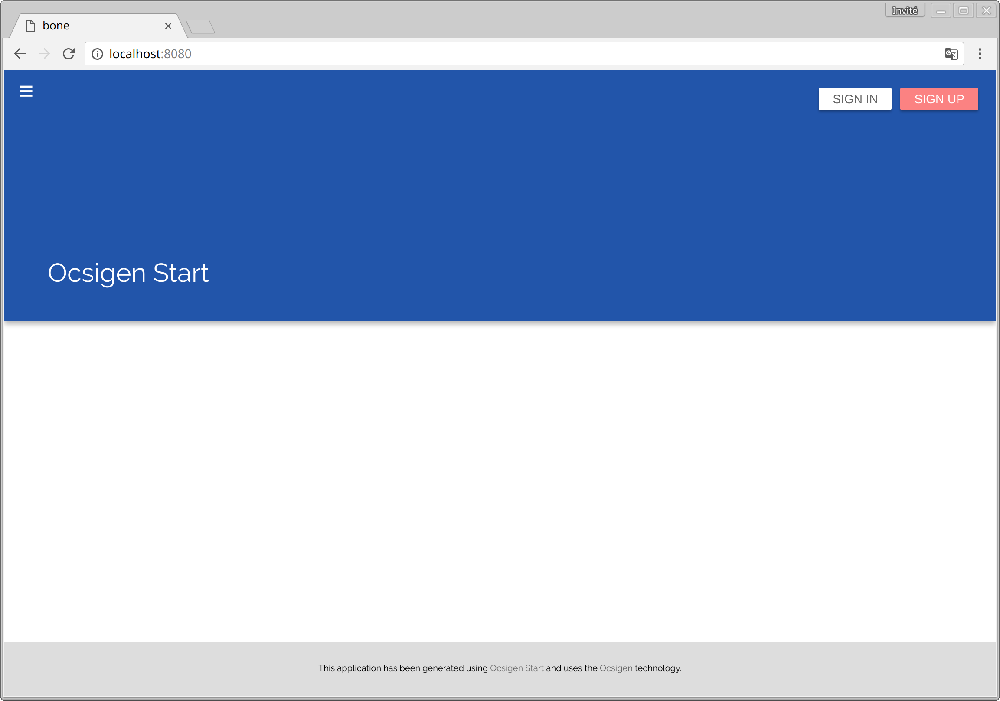](files/screenshots/start1.png) [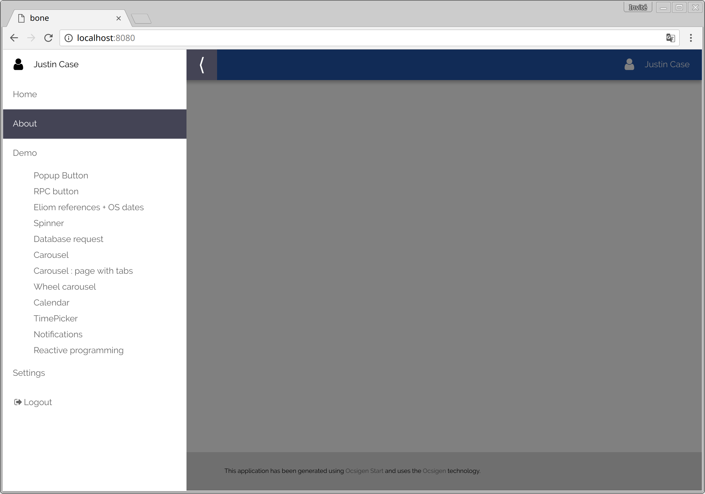](files/screenshots/start2.png)

 [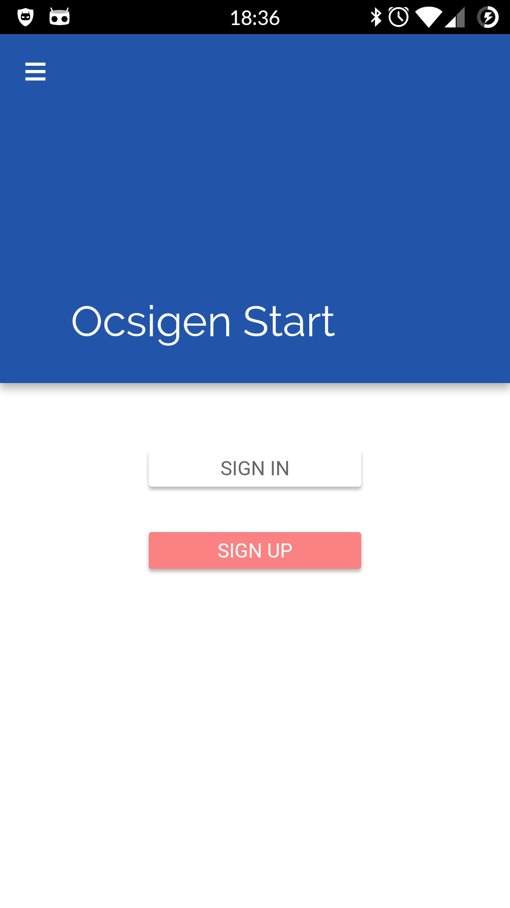](files/screenshots/start-mobile-1.png) [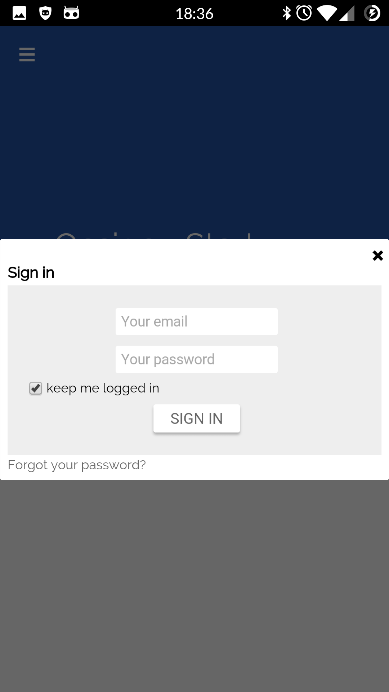](files/screenshots/start-mobile-2.png) [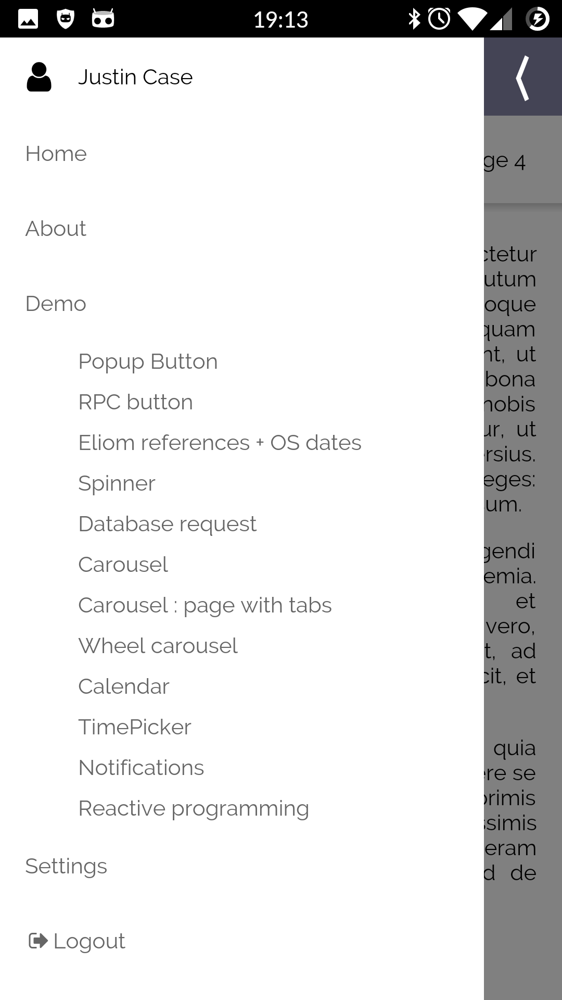](files/screenshots/start-mobile-4.png)

Ocsigen Start is composed by two main parts:

- The generated code which gives a default behaviour to your application. Adapt it to your needs and remove the parts you don't need. Feel free to redistribute it as you wish.<br/> It includes a demo of many features from Eliom, Js\_of\_ocaml, Tyxml, Ocsigen Toolkit. Use it to learn quickly the main principles of multi-tier programming.
- A library with:
- User management: authentication, registration of new users with activation links sent by email, recover lost password, page to update settings, etc.
- Tips for new users
- Push notifications to send information to other users
- ...
 [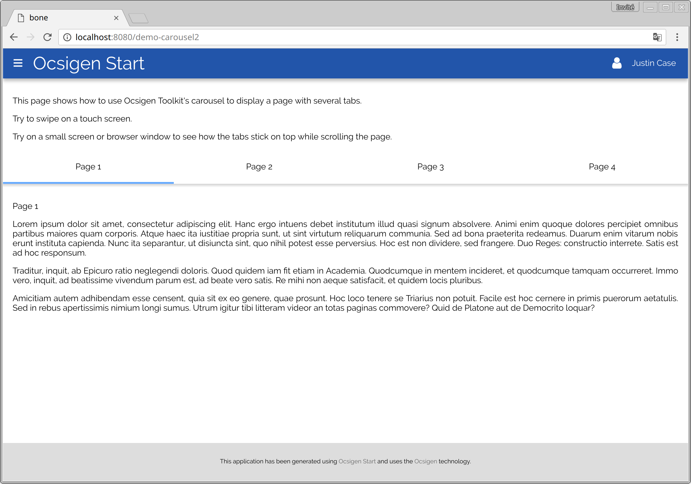](files/screenshots/start3.png) [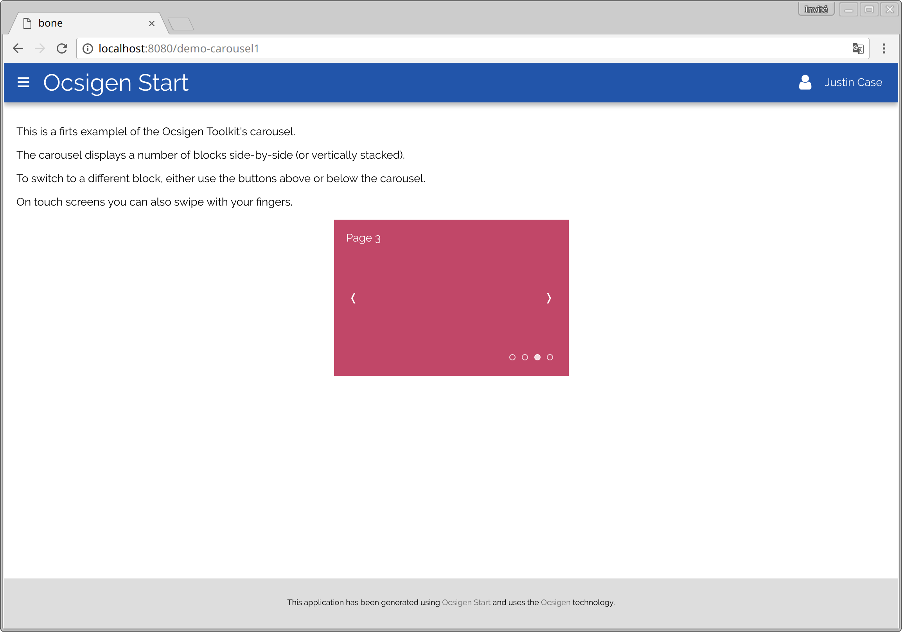](files/screenshots/start4.png) [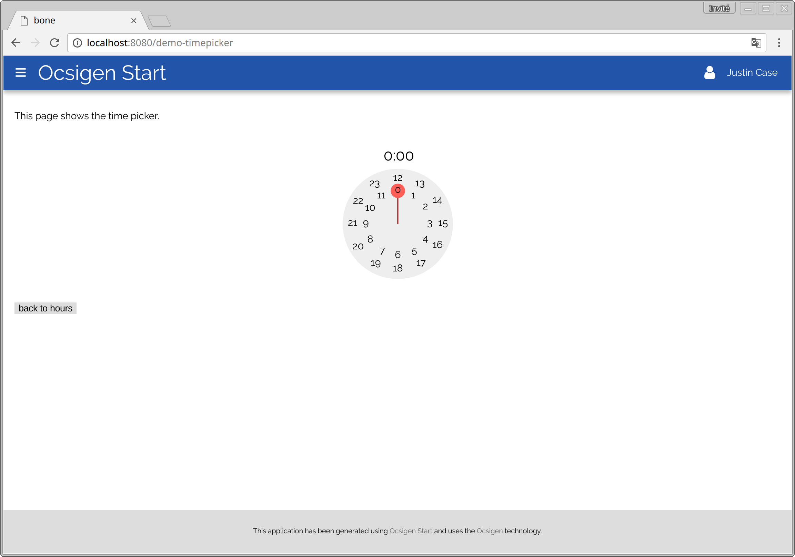](files/screenshots/start5.png) [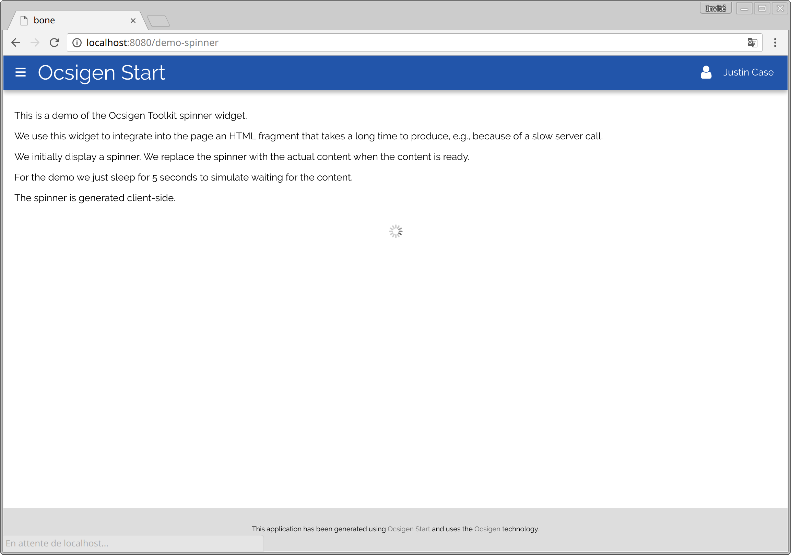](files/screenshots/start6.png)

 [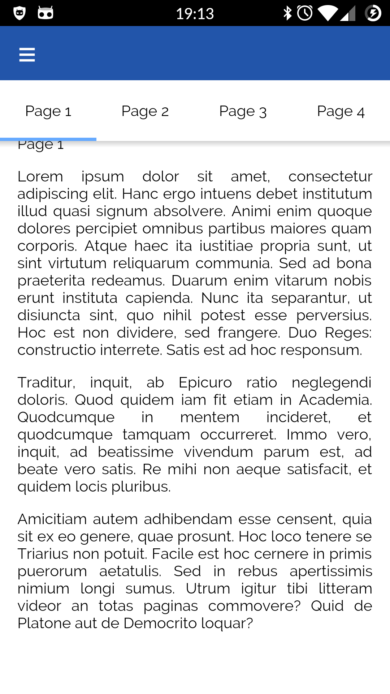](files/screenshots/start-mobile-3.png) [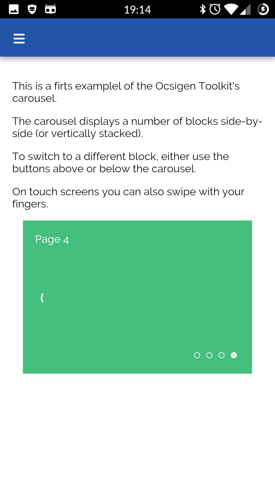](files/screenshots/start-mobile-6.png) [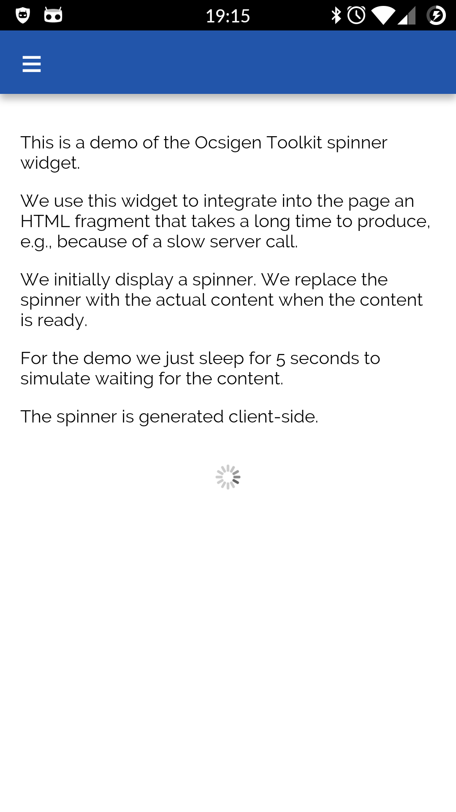](files/screenshots/start-mobile-7.png) [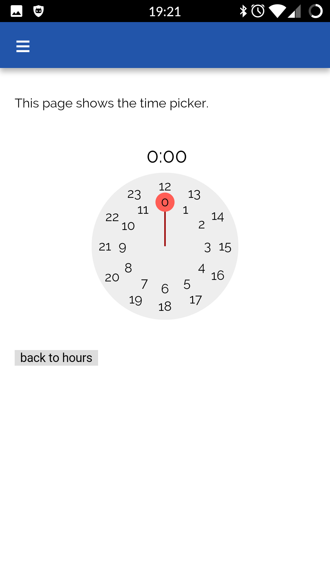](files/screenshots/start-mobile-8.png)

## Getting started

Read [this page](https://ocsigen.org/tuto/start.html) to learn how to build your first Ocsigen Start app in 5 minutes.

## Implementation overview

### Template

The library portion of Ocsigen Start contains core functionality that is common across Ocsigen Start applications, while the template can be customized for the specific application at hand.

The template additionally contains a demonstration of relevant [Ocsigen Toolkit](https://github.com/ocsigen/ocsigen-toolkit) widgets. The demo portion can easily be removed.

### Database

For implementing users, a database is needed. Specifically, we use [PostgreSQL](https://www.postgresql.org/) via the [PGOCaml](http://pgocaml.forge.ocamlcore.org/) library. The template and the library make common assumptions about the database schema. The database thus needs to be instantiated in a certain way; this is automatically done by appropriate targets in the template's build system.

The same database can used for the specific needs of the application at hand. For that, new tables can be added. The original ones should remain in place for Ocsigen Start to work correctly.

### Internationalization (i18n)

The template is available in multiple languages (English and French) using [ocsigen-i18n](https://github.com/besport/ocsigen-i18n). All translations used in the template are defined in the file `assets/PROJECT_NAME_i18n.tsv`. The Makefile rule `i18n-udpate` generates the i18n module. You need to use it every time the TSV file is updated.

See `Makefile.i18n` for rules about i18n and `Makefile.options` to personalize the internalization of your application (for example add new languages, change default language, change TSV filename).

### Managing e-mails

The template application keeps track of users' e-mails and implements e-mail validation. For that, `sendmail` (or another mail transfer agent compatible with it) needs to be installed on the host.

### Style

The application provides a standard style matching contemporary aesthetics. For this, we use [SASS](http://sass-lang.com/). The style can be customized by modifying the SASS files that are part of the template.

## Installation

Ocsigen Start can be installed via [OPAM](https://opam.ocaml.org/). The package name is `ocsigen-start`. The template application can be instantiated via `eliom-distillery`:

```shell
eliom-distillery -name $APP_NAME -template os
```
(Replace \$APP\_NAME by the name of your application).

For details on launching the application, refer to the template's [README](https://github.com/ocsigen/ocsigen-start/blob/master/template.distillery/README.md).

## Library overview

We provide a tour of the Ocsigen Start library. All modules have server- and client-side versions. (In the API documentation, there are links near the top of each module page for selecting the side.)

The template uses all these modules, and can thus act as a good starting guide. Look around\!

### User interface

Various modules for producing icons, messages, custom pages, tips, connection forms, etc.

- [`Os.Icons`](./ocsigen-start.server/Os-Icons.md): manage CSS icons.
- [`Os.Msg`](./ocsigen-start.server/Os-Msg.md): write messages in the browser console.
- [`Os.Page`](./ocsigen-start.server/Os-Page.md): utilities for building HTML pages that follow the standard Ocsigen Start layout.
- [`Os.Tips`](./ocsigen-start.server/Os-Tips.md): display tips to the user.
- [`Os.User_view`](./ocsigen-start.server/Os-User_view.md): functions for creating password forms and other common UI elements appearing in applications and for managing the user connection box.
- [`Os.Uploader`](./ocsigen-start.server/Os-Uploader.md): ImageMagick-based tools for manipulating avatars.

### Users and groups

- [`Os.User`](./ocsigen-start.server/Os-User.md), [`Os.Current_user`](./ocsigen-start.server/Os-Current_user.md), [`Os.Group`](./ocsigen-start.server/Os-Group.md): manage users and groups thereof.
- [`Os.Db`](./ocsigen-start.server/Os-Db.md): directly access the database. In many cases, it is a better idea to use higher-level modules (e.g., [`Os.User`](./ocsigen-start.server/Os-User.md)).
- [`Os.Types`](./ocsigen-start.server/Os-Types.md): core types shared by [`Os.Db`](./ocsigen-start.server/Os-Db.md) and the higher-level modules.

### Communication

- [`Os.Notif`](./ocsigen-start.server/Os-Notif.md): send notifications to connected users.
- [`Os.Email`](./ocsigen-start.server/Os-Email.md): send e-mails.
- [`Os.Fcm_notif`](./ocsigen-start.server/Os-Fcm_notif.md): send push notifications to mobile devices.
- [`Os.Comet`](./ocsigen-start.server/Os-Comet.md): manage the bi-directional communication channel between client and server. This is a low-level module that you probably don't need.

### Services, handlers, sessions

- [`Os.Services`](./ocsigen-start.server/Os-Services.md): Eliom services pre-defined by Ocsigen Start. These produce the default user interface of the template. See `the Eliom manual page on services` for a general introduction to Eliom services.
- [`Os.Handlers`](./ocsigen-start.server/Os-Handlers.md): The handlers (functions) that implement the services in [`Os.Services`](./ocsigen-start.server/Os-Services.md). `The Eliom manual page on service handlers` explains how to implement handlers.
- [`Os.Session`](./ocsigen-start.server/Os-Session.md): manage user sessions, e.g., execute actions when users connect or disconnect.

### Other utilities

- [`Os.Date`](./ocsigen-start.server/Os-Date.md): utilities for manipulating date and time values.
- [`Os.Platform`](./ocsigen-start.server/Os-Platform.md): obtain information about the platform we are on (Android, iOS, ...).
- [`Os.Request_cache`](./ocsigen-start.server/Os-Request_cache.md), [`Os.User_proxy`](./ocsigen-start.server/Os-User_proxy.md): different forms of caching data.
- A *ppx* syntax extension to implement RPC.
